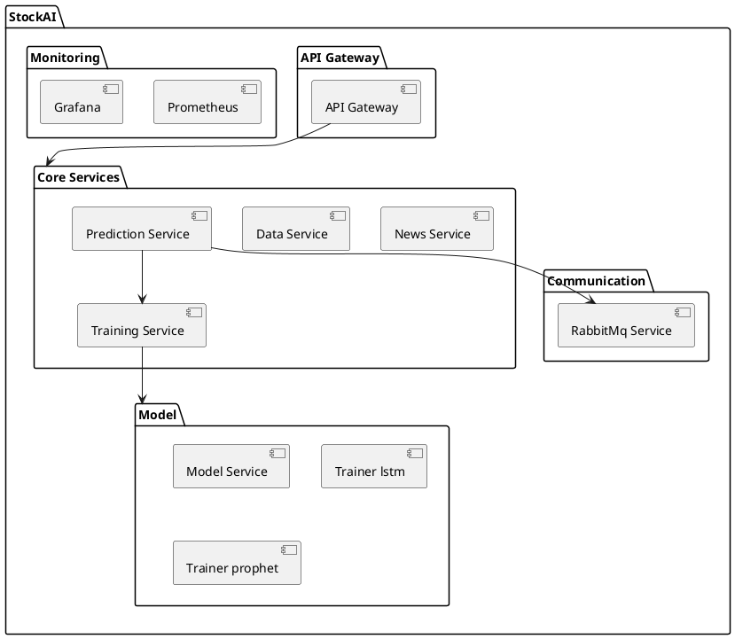

# 4+1 Architecture Development and Physical Views – Stock-ai Microservice

## 1. Development View


## 2. Physical View
```plantuml
@startuml
allowmixing

node "Stock-ai Cluster" {

  node "API Gateway" {
    component "API Gateway" as API
  }

  queue "Orchestrator"
  
  node "Core services"
  
  node "Monitoring"
  queue "RabbitMQ"
  database "Redis Cache" 
}

node "Backend_Microservice"

API --> "Orchestrator"
"Orchestrator" --> "Core services"
"Core services" --> "RabbitMQ"
"RabbitMQ" --> "Backend_Microservice"
"Monitoring" --> "Core services"
' "Backend_Microservice" --> "API Gateway"
@enduml
